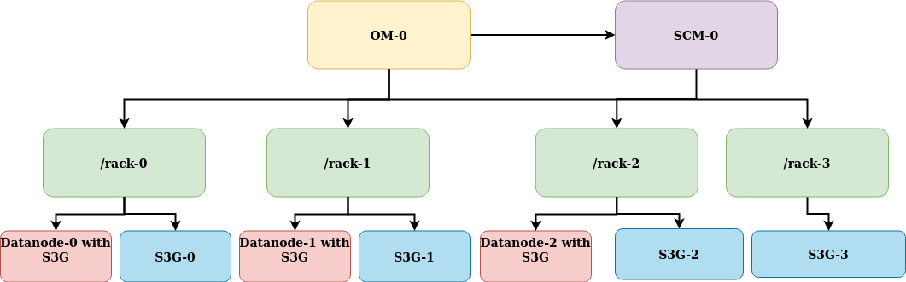

# Topology Aware S3G's proof of concept
This proof of concept consists of the following parts:

1. An modified S3G get() endpoint that redirects the request to the appropriate S3g
2. A bucket based registry service that allows the S3G's to know the location of the others.
3. A demo kubernetes cluster that allows you to easily try requests from different S3G's
4. An ozone "network topology" that defines virtual racks for the datanodes and S3Gs


The diffs from ozone master are [here](https://github.com/GeorgeJahad/ozone/compare/3012cd138ee4436b1d03dc151e5fef1b60c7f82d...topologyAwareS3Poc#files_bucket)

The design doc is [here](./topologyAwareS3G.docx).

## Topology of the demo cluster

The k8s cluster created by this demo looks like .
There are 3 datanode pods, each containing both the datanode app and the s3g app.  In addition, there are 4 dedicated s3g pods, for a total of 7 s3g's in the cluster.  (The individual s3g's are referred to below as: s0-s3, and d0-d2.)

Racks 0-2 have both a datanode and an s3g, (corresponding to datanode's 0-2 and s3g's 0-2 respectively.  On rack-3, there is only a single node, s3g-3.


## Starting the demo cluster

To run the POC demo, you'll need java, maven and kubernetes installed on your system.

The demo is only tested on linux, but should work on OSX if you install these tools:

```
brew install minio/stable/mc
brew install elek/brew/flekszible
```

To get the poc:
```
mkdir topologyAwareS3Poc
cd topologyAwareS3Poc
git clone https://github.com/GeorgeJahad/ozone.git --branch topologyAwareS3Poc
```

To build the jars and start the demo k8s cluster:
```
cd ozone/topologyAwareS3Poc
source ./setup.sh
```

## Running the demo

The purpose of the demo is generate s3 read traffic to different endpoints and watch the logs to see how the redirects occur.

There are 3 datanodes and a replication factor of three so all files exist on all 3 datanodes.

Note all commands below are to be run from the *topologyAwareS3Poc/ozone/topologyAwareS3Poc* directory.

To run the demo, first start the logging:
```
./pocLog.sh &
```

Then to generate a read from the s3g-2 endpoint run:
```
./pocRead.sh s2
```

You should see something like:
```
[pod/s3g-2/s3g] 2021-12-10 23:00:04 INFO  ObjectEndpoint:451 - S3POC: redirecting to datanode-0.datanode.default.svc.cluster.local
[pod/datanode-0/s3g] 2021-12-10 23:00:04 INFO  ObjectEndpoint:269 - S3POC: handling request locally, key: dummy-file
[pod/datanode-0/s3g] 2021-12-10 23:00:04 INFO  XceiverClientGrpc:144 - S3POC: connecting to datanode: datanode-0.datanode.default.svc.cluster.local

```

The first line shows s2 receiving the command and redirecting to the s3g on d0.  The second line shows d0 handling it locally.  The third line shows which datanode, (not S3G,) is receiving the actual request.

If the same command is run multiple times it will randomly redirect to the S3G's on d0-2 because each is on a datanode and each datanode has all files.

If the commands are run in quick succession sometimes you will only see the first two lines because the connection listed in the 3rd line is reused, (and so not logged.)

## Removing nodes from the registry

An S3G can be removed from the registry like so:
```
./pocRead.sh d0
```

That will remove the s3g on d0 from the registry so that requests will no longer be redirected to it.  (Note that it takes 5 seconds for the registry to refresh.)

If 2 of the datanodes are unregistered, then all traffic from s0-s3 will be redirected to the remaining one.  If all three are removed, then all traffic from s3 will go to s0-s2, (each of which is on a rack with a datanode.)

Note that in this case, due to the datalocality read bug in ozone that I mentioned in our meeting, the data won't necessarily be read from the correct datanode.  For example, this command:
```
./pocRead.sh s3
```

could return these results:
```
[pod/s3g-3/s3g] 2021-12-10 23:16:48 INFO  ObjectEndpoint:451 - S3POC: redirecting to s3g-0.s3g.default.svc.cluster.local
[pod/s3g-0/s3g] 2021-12-10 23:16:49 INFO  ObjectEndpoint:269 - S3POC: handling request locally, key: dummy-file
[pod/s3g-0/s3g] 2021-12-10 23:16:49 INFO  XceiverClientGrpc:144 - S3POC: connecting to datanode: datanode-1.datanode.default.svc.cluster.local
```
S3G-3 redirected to s0, which has a datanode on rack-0, but instead of reading from that datanode, it read from datanode-1.

I hope to submit a PR for this bug in the next few weeks.


